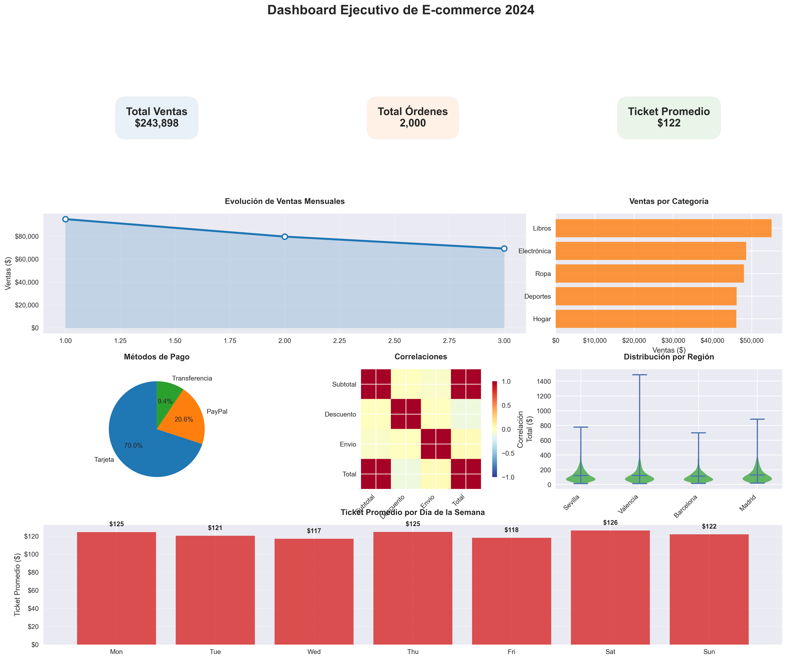
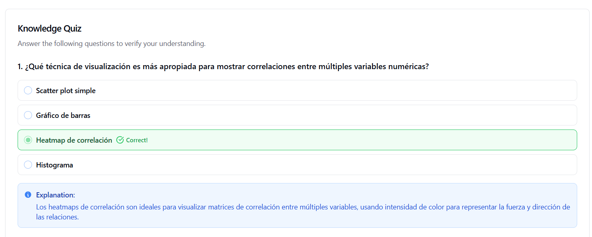

# Dashboard Analítico de E-commerce 📊
| Autor            | Fecha        | Día |
|------------------|--------------|----------|
| **Carlos Vásquez** |02 Enero 2026 | 3|
Dashboard ejecutivo completo para análisis de datos de comercio electrónico, construido con Python, Pandas y Matplotlib.



## 📋 Descripción

Este proyecto genera un dashboard profesional con múltiples visualizaciones que permiten analizar el rendimiento de un negocio de e-commerce desde diferentes perspectivas: ventas mensuales, categorías de productos, métodos de pago, análisis regional y patrones temporales.

El dashboard incluye 7 visualizaciones interconectadas que proporcionan una visión 360° del negocio, desde KPIs de alto nivel hasta análisis detallados de correlaciones y distribuciones estadísticas.

## 🎯 Características

- **KPIs principales**: Total de ventas, número de órdenes y ticket promedio
- **Análisis temporal**: Tendencias mensuales y patrones por día de la semana
- **Segmentación**: Por categoría de producto, región y método de pago
- **Análisis estadístico**: Correlaciones entre variables y distribuciones
- **Visualizaciones avanzadas**: Heatmaps, violin plots, gráficos de líneas y barras
- **Exportación de alta calidad**: Imagen PNG a 300 DPI lista para presentaciones

## 🛠️ Requisitos

### Software Necesario

- Python 3.8 o superior
- Jupyter Notebook (opcional pero recomendado)
- Git (opcional, para clonar el repositorio)

### Librerías de Python

```bash
pip install pandas numpy matplotlib
```

O si usas conda:

```bash
conda install pandas numpy matplotlib
```

### Versiones Recomendadas

- pandas >= 1.5.0
- numpy >= 1.24.0
- matplotlib >= 3.7.0

## 📦 Instalación

### Paso 1: Clonar o descargar el proyecto

```bash
# Si está en un repositorio
git clone <url-del-repositorio>
cd dashboard-ecommerce

# O simplemente crea una carpeta y guarda el archivo
mkdir dashboard-ecommerce
cd dashboard-ecommerce
```

### Paso 2: Crear entorno virtual (recomendado)

**Con venv:**
```bash
python -m venv venv
source venv/bin/activate  # En Windows: venv\Scripts\activate
```

**Con conda:**
```bash
conda create -n ecommerce python=3.10
conda activate ecommerce
```

### Paso 3: Instalar dependencias

```bash
pip install pandas numpy matplotlib
```

### Paso 4: Verificar instalación

```python
import pandas as pd
import numpy as np
import matplotlib.pyplot as plt

print(f"Pandas: {pd.__version__}")
print(f"NumPy: {np.__version__}")
print(f"Matplotlib: {plt.matplotlib.__version__}")
```

## 🚀 Uso

### Opción 1: Jupyter Notebook (Recomendado)

1. Inicia Jupyter Notebook:
```bash
jupyter notebook
```

2. Crea un nuevo notebook Python 3

3. Copia el código completo (ver sección de código abajo)

4. Ejecuta cada celda secuencialmente con `Shift + Enter`

### Opción 2: Script Python

1. Crea un archivo `dashboard_ecommerce.py`

2. Copia el código completo del proyecto

3. Ejecuta:
```bash
python dashboard_ecommerce.py
```

4. El dashboard se guardará como `dashboard_ecommerce_completo.png`

## 💻 Código Completo del Proyecto

### Parte 1: Configuración del Entorno y Dataset

```python
import pandas as pd
import numpy as np
import matplotlib.pyplot as plt
import matplotlib as mpl
from matplotlib.gridspec import GridSpec

# Configuración profesional
plt.style.use('seaborn-v0_8')
mpl.rcParams.update({
    'font.size': 10,
    'figure.figsize': (16, 10),
    'savefig.dpi': 300,
    'savefig.bbox': 'tight'
})

# Paleta de colores
colores = ['#1f77b4', '#ff7f0e', '#2ca02c', '#d62728', '#9467bd', '#8c564b']

# Generar dataset de e-commerce avanzado
np.random.seed(42)
n_ordenes = 2000

df = pd.DataFrame({
    'fecha': pd.date_range('2024-01-01', periods=n_ordenes, freq='H'),
    'cliente_id': np.random.randint(1, 401, n_ordenes),
    'categoria': np.random.choice(['Electrónica', 'Ropa', 'Hogar', 'Libros', 'Deportes'], n_ordenes),
    'subtotal': np.round(np.random.lognormal(4.5, 0.8, n_ordenes), 2),
    'descuento': np.round(np.random.uniform(0, 0.3, n_ordenes), 2),
    'envio': np.round(np.random.uniform(5, 25, n_ordenes), 2),
    'region': np.random.choice(['Madrid', 'Barcelona', 'Valencia', 'Sevilla'], n_ordenes),
    'metodo_pago': np.random.choice(['Tarjeta', 'PayPal', 'Transferencia'], n_ordenes, p=[0.7, 0.2, 0.1])
})

# Calcular métricas
df['total'] = df['subtotal'] * (1 - df['descuento']) + df['envio']
df['mes'] = df['fecha'].dt.month
df['dia_semana'] = df['fecha'].dt.day_name()

print(f"Dataset de e-commerce creado: {len(df)} órdenes")
print(f"Período: {df['fecha'].min()} a {df['fecha'].max()}")
```

### Parte 2: Creación del Dashboard Completo

```python
# Crear dashboard con GridSpec para layout flexible
fig = plt.figure(figsize=(20, 16))
gs = GridSpec(4, 6, figure=fig, hspace=0.3, wspace=0.3)

# Título principal
fig.suptitle('Dashboard Ejecutivo de E-commerce 2024', fontsize=20, fontweight='bold', y=0.95)

# ========================================
# 1. KPIs principales (superior)
# ========================================
ax_kpi1 = fig.add_subplot(gs[0, :2])
ax_kpi2 = fig.add_subplot(gs[0, 2:4])
ax_kpi3 = fig.add_subplot(gs[0, 4:])

# KPI 1: Total de ventas
total_ventas = df['total'].sum()
ax_kpi1.text(0.5, 0.5, f'Total Ventas\n${total_ventas:,.0f}', 
             ha='center', va='center', fontsize=16, fontweight='bold',
             bbox=dict(boxstyle='round,pad=1', facecolor=colores[0], alpha=0.1))
ax_kpi1.set_xlim(0, 1)
ax_kpi1.set_ylim(0, 1)
ax_kpi1.axis('off')

# KPI 2: Número de órdenes
num_ordenes = len(df)
ax_kpi2.text(0.5, 0.5, f'Total Órdenes\n{num_ordenes:,}', 
             ha='center', va='center', fontsize=16, fontweight='bold',
             bbox=dict(boxstyle='round,pad=1', facecolor=colores[1], alpha=0.1))
ax_kpi2.axis('off')

# KPI 3: Ticket promedio
ticket_promedio = df['total'].mean()
ax_kpi3.text(0.5, 0.5, f'Ticket Promedio\n${ticket_promedio:.0f}', 
             ha='center', va='center', fontsize=16, fontweight='bold',
             bbox=dict(boxstyle='round,pad=1', facecolor=colores[2], alpha=0.1))
ax_kpi3.axis('off')

# ========================================
# 2. Tendencia mensual (fila 1, columnas 0-3)
# ========================================
ax_trend = fig.add_subplot(gs[1, :4])
ventas_mes = df.groupby('mes')['total'].sum()
ax_trend.plot(ventas_mes.index, ventas_mes.values, 'o-', linewidth=3, 
              color=colores[0], markersize=8, markerfacecolor='white', markeredgewidth=2)
ax_trend.fill_between(ventas_mes.index, ventas_mes.values, alpha=0.2, color=colores[0])
ax_trend.set_title('Evolución de Ventas Mensuales', fontweight='bold', pad=15)
ax_trend.set_ylabel('Ventas ($)')
ax_trend.grid(True, alpha=0.3)
ax_trend.yaxis.set_major_formatter(mpl.ticker.StrMethodFormatter('${x:,.0f}'))

# ========================================
# 3. Distribución por categoría (fila 1, columnas 4-5)
# ========================================
ax_categoria = fig.add_subplot(gs[1, 4:])
ventas_cat = df.groupby('categoria')['total'].sum().sort_values(ascending=True)
bars = ax_categoria.barh(ventas_cat.index, ventas_cat.values, color=colores[1], alpha=0.8)
ax_categoria.set_title('Ventas por Categoría', fontweight='bold', pad=15)
ax_categoria.set_xlabel('Ventas ($)')
ax_categoria.xaxis.set_major_formatter(mpl.ticker.StrMethodFormatter('${x:,.0f}'))

# ========================================
# 4. Análisis de métodos de pago (fila 2, izquierda)
# ========================================
ax_pago = fig.add_subplot(gs[2, :2])
pago_counts = df['metodo_pago'].value_counts()
wedges, texts, autotexts = ax_pago.pie(pago_counts.values, labels=pago_counts.index, 
                                      autopct='%1.1f%%', colors=colores[:3], startangle=90)
ax_pago.set_title('Métodos de Pago', fontweight='bold', pad=15)

# ========================================
# 5. Heatmap de correlaciones (fila 2, centro)
# ========================================
ax_corr = fig.add_subplot(gs[2, 2:4])
numeric_cols = ['subtotal', 'descuento', 'envio', 'total']
corr_matrix = df[numeric_cols].corr()
im = ax_corr.imshow(corr_matrix, cmap='RdYlBu_r', vmin=-1, vmax=1)
ax_corr.set_xticks(np.arange(len(numeric_cols)))
ax_corr.set_yticks(np.arange(len(numeric_cols)))
ax_corr.set_xticklabels([col.title() for col in numeric_cols], rotation=45, ha='right')
ax_corr.set_yticklabels([col.title() for col in numeric_cols])
ax_corr.set_title('Correlaciones', fontweight='bold', pad=15)

# Barra de color para heatmap
cbar = fig.colorbar(im, ax=ax_corr, shrink=0.8)
cbar.set_label('Correlación')

# ========================================
# 6. Violin plot por región (fila 2, derecha)
# ========================================
ax_region = fig.add_subplot(gs[2, 4:])
region_data = [df[df['region'] == region]['total'] for region in df['region'].unique()]
vp = ax_region.violinplot(region_data, showmeans=True)
for pc in vp['bodies']:
    pc.set_facecolor(colores[2])
    pc.set_alpha(0.7)
ax_region.set_xticks(range(1, len(df['region'].unique()) + 1))
ax_region.set_xticklabels(df['region'].unique(), rotation=45, ha='right')
ax_region.set_title('Distribución por Región', fontweight='bold', pad=15)
ax_region.set_ylabel('Total ($)')

# ========================================
# 7. Análisis de días de la semana (fila 3, completa)
# ========================================
ax_dia = fig.add_subplot(gs[3, :])
orden_dias = ['Monday', 'Tuesday', 'Wednesday', 'Thursday', 'Friday', 'Saturday', 'Sunday']
ventas_dia = df.groupby('dia_semana')['total'].mean().reindex(orden_dias)
bars_dia = ax_dia.bar(range(len(ventas_dia)), ventas_dia.values, color=colores[3], alpha=0.8)
ax_dia.set_xticks(range(len(ventas_dia)))
ax_dia.set_xticklabels([dia[:3] for dia in orden_dias])
ax_dia.set_title('Ticket Promedio por Día de la Semana', fontweight='bold', pad=15)
ax_dia.set_ylabel('Ticket Promedio ($)')
ax_dia.yaxis.set_major_formatter(mpl.ticker.StrMethodFormatter('${x:,.0f}'))
ax_dia.grid(True, alpha=0.3, axis='y')

# Añadir valores encima de las barras
for bar, valor in zip(bars_dia, ventas_dia.values):
    height = bar.get_height()
    ax_dia.text(bar.get_x() + bar.get_width()/2., height + 5, 
               f'${valor:.0f}', ha='center', va='bottom', fontweight='bold')

# ========================================
# Guardar dashboard
# ========================================
plt.savefig('dashboard_ecommerce_completo.png', dpi=300, bbox_inches='tight')
print("\nDashboard comprehensivo guardado como 'dashboard_ecommerce_completo.png'")

# Mostrar en pantalla (opcional)
plt.show()
```

## 📊 Estructura del Dashboard

El dashboard utiliza GridSpec para crear un layout profesional dividido en 4 filas y 6 columnas:

### Fila 0: KPIs Principales (3 paneles)
- **Panel 1-2**: Total de Ventas ($)
- **Panel 3-4**: Total de Órdenes (#)
- **Panel 5-6**: Ticket Promedio ($)

### Fila 1: Análisis de Tendencias
- **Columnas 1-4**: Evolución de Ventas Mensuales (gráfico de líneas)
- **Columnas 5-6**: Ventas por Categoría (barras horizontales)

### Fila 2: Análisis Multidimensional
- **Columnas 1-2**: Métodos de Pago (gráfico circular)
- **Columnas 3-4**: Heatmap de Correlaciones (matriz)
- **Columnas 5-6**: Distribución Regional (violin plots)

### Fila 3: Análisis Temporal
- **Columnas 1-6**: Ticket Promedio por Día de la Semana (barras)

## 📈 Explicación Paso a Paso del Código

### Paso 1: Importación de Librerías

```python
import pandas as pd
import numpy as np
import matplotlib.pyplot as plt
import matplotlib as mpl
from matplotlib.gridspec import GridSpec
```

**¿Qué hace?**
- `pandas`: Manipulación y análisis de datos
- `numpy`: Operaciones numéricas y generación de datos aleatorios
- `matplotlib.pyplot`: Creación de gráficos
- `GridSpec`: Layout flexible para múltiples subplots

### Paso 2: Configuración Visual

```python
plt.style.use('seaborn-v0_8')
mpl.rcParams.update({
    'font.size': 10,
    'figure.figsize': (16, 10),
    'savefig.dpi': 300,
    'savefig.bbox': 'tight'
})
```

**¿Qué hace?**
- Aplica el estilo visual seaborn para gráficos profesionales
- Configura el tamaño de fuente predeterminado
- Define dimensiones de la figura
- Establece resolución de exportación (300 DPI = calidad profesional)

### Paso 3: Paleta de Colores

```python
colores = ['#1f77b4', '#ff7f0e', '#2ca02c', '#d62728', '#9467bd', '#8c564b']
```

**¿Qué hace?**
Define una paleta de 6 colores consistente para todas las visualizaciones.

### Paso 4: Generación de Dataset Sintético

```python
np.random.seed(42)
n_ordenes = 2000

df = pd.DataFrame({...})
```

**¿Qué hace?**
- Establece semilla aleatoria para reproducibilidad
- Crea 2000 órdenes de ejemplo
- Genera datos realistas con distribuciones apropiadas:
  - Fechas: Rango continuo horario
  - Subtotal: Distribución log-normal (realista para precios)
  - Descuento: Distribución uniforme (0-30%)
  - Categorías, regiones, métodos de pago con probabilidades específicas

### Paso 5: Cálculo de Métricas Derivadas

```python
df['total'] = df['subtotal'] * (1 - df['descuento']) + df['envio']
df['mes'] = df['fecha'].dt.month
df['dia_semana'] = df['fecha'].dt.day_name()
```

**¿Qué hace?**
- Calcula el total aplicando descuentos y añadiendo envío
- Extrae el mes para análisis temporal
- Obtiene el nombre del día de la semana

### Paso 6: Creación de Layout con GridSpec

```python
fig = plt.figure(figsize=(20, 16))
gs = GridSpec(4, 6, figure=fig, hspace=0.3, wspace=0.3)
```

**¿Qué hace?**
- Crea una figura de 20x16 pulgadas
- Define una cuadrícula de 4 filas × 6 columnas
- `hspace` y `wspace`: Espaciado entre paneles

### Paso 7: KPIs con Cajas de Texto

```python
ax_kpi1.text(0.5, 0.5, f'Total Ventas\n${total_ventas:,.0f}', 
             ha='center', va='center', fontsize=16, fontweight='bold',
             bbox=dict(boxstyle='round,pad=1', facecolor=colores[0], alpha=0.1))
```

**¿Qué hace?**
- Crea cajas de texto centradas con métricas clave
- Usa formato de miles con comas
- Aplica cajas redondeadas con color de fondo semi-transparente

### Paso 8: Gráficos Especializados

Cada tipo de gráfico tiene su propósito:

**Líneas con área rellena**: Muestra tendencias temporales
**Barras horizontales**: Compara categorías
**Gráfico circular**: Muestra proporciones
**Heatmap**: Visualiza correlaciones
**Violin plots**: Muestra distribuciones completas
**Barras con anotaciones**: Compara valores con etiquetas

## 🔍 Análisis de Insights

### Preguntas Clave para el Negocio

#### 1. ¿Cuál es la salud financiera general?
- Observa los 3 KPIs principales
- Calcula la tasa de crecimiento mensual
- Compara el ticket promedio con objetivos

#### 2. ¿Qué categorías impulsan las ventas?
- Identifica las 2 categorías principales
- Analiza si hay categorías con bajo rendimiento
- Considera estrategias de cross-selling

#### 3. ¿Los descuentos están bien calibrados?
- Revisa el heatmap de correlaciones
- Analiza la relación descuento-total
- Evalúa si los descuentos aumentan el volumen

#### 4. ¿Hay oportunidades regionales?
- Compara los violin plots entre regiones
- Identifica regiones con mayor variabilidad
- Busca oportunidades de expansión

#### 5. ¿Qué días optimizar la operación?
- Identifica los días con mayor ticket promedio
- Planifica inventario según patrones
- Ajusta personal según demanda

#### 6. ¿Los métodos de pago son adecuados?
- Verifica la diversidad de opciones
- Considera añadir métodos emergentes
- Optimiza comisiones por método

## 🎨 Personalización Avanzada

### Cambiar el Dataset

```python
# Usar datos reales desde CSV
df = pd.read_csv('tus_datos_reales.csv')
df['fecha'] = pd.to_datetime(df['fecha'])
```

### Modificar Colores

```python
# Paleta corporativa personalizada
colores = ['#FF6B6B', '#4ECDC4', '#45B7D1', '#FFA07A', '#98D8C8', '#F7DC6F']
```

### Ajustar el Período

```python
# Analizar últimos 6 meses
df = df[df['fecha'] >= '2024-07-01']
```

### Agregar Nuevas Visualizaciones

```python
# Añadir un nuevo subplot
ax_nuevo = fig.add_subplot(gs[fila, columna])
# Tu visualización aquí
```

### Cambiar Idioma

```python
# Traducir días de la semana
dias_es = ['Lun', 'Mar', 'Mié', 'Jue', 'Vie', 'Sáb', 'Dom']
ax_dia.set_xticklabels(dias_es)
```

## 📊 Análisis Estadístico Incluido

### Correlaciones (Heatmap)

El heatmap muestra correlaciones de Pearson entre:
- **Subtotal y Total**: Correlación fuerte positiva esperada
- **Descuento y Total**: Correlación negativa (más descuento = menos ganancia)
- **Envío y Total**: Impacto del costo de envío

### Distribuciones (Violin Plots)

Los violin plots muestran:
- **Mediana**: Línea central
- **Cuartiles**: Ancho del violin
- **Outliers**: Valores atípicos
- **Densidad**: Forma del violin

## 🐛 Solución de Problemas

### Error: "No module named 'pandas'"

```bash
pip install pandas numpy matplotlib
```

### Error: "plt.style.use('seaborn-v0_8') not found"

```python
# Usar estilo alternativo
plt.style.use('seaborn-v0_8-darkgrid')
# O
plt.style.use('ggplot')
```

### Las gráficas se ven mal en Jupyter

```python
# Al inicio del notebook
%matplotlib inline
import matplotlib.pyplot as plt
plt.rcParams['figure.dpi'] = 100
```

### El archivo PNG no se guarda

```python
# Verificar permisos de escritura
import os
print(os.getcwd())  # Ver directorio actual

# Guardar en ubicación específica
plt.savefig('/ruta/completa/dashboard.png', dpi=300, bbox_inches='tight')
```

### Advertencia: "tight_layout"

```python
# Usar bbox_inches='tight' en savefig
plt.savefig('dashboard.png', dpi=300, bbox_inches='tight')
```

### Fuentes no se ven bien

```python
# Configurar fuente específica
mpl.rcParams['font.family'] = 'DejaVu Sans'
# O
mpl.rcParams['font.family'] = 'Arial'
```


## 🚀 Próximos Pasos

### Mejoras Sugeridas

1. **Interactividad**: Migrar a Plotly para dashboards interactivos
2. **Automatización**: Crear script que actualice el dashboard diariamente
3. **Datos Reales**: Conectar a base de datos SQL o API
4. **Filtros**: Añadir filtros por fecha, región, categoría
5. **Exportación**: Generar PDF con reportes automáticos
6. **Alertas**: Implementar notificaciones por métricas críticas

### Código para Dashboard Interactivo (Plotly)

```python
# Versión interactiva básica
import plotly.graph_objects as go
from plotly.subplots import make_subplots

fig = make_subplots(
    rows=2, cols=2,
    subplot_titles=('Ventas Mensuales', 'Por Categoría', 
                    'Métodos de Pago', 'Por Región')
)

# Añadir trazas interactivas
fig.add_trace(go.Scatter(x=ventas_mes.index, y=ventas_mes.values), 
              row=1, col=1)

fig.show()
```


---

## Test de Evaluación



**Desarrollado para aprendizaje de visualización de datos con Python** 🐍📊

**Última actualización**: Enero 2026